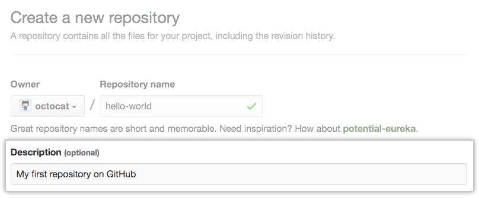
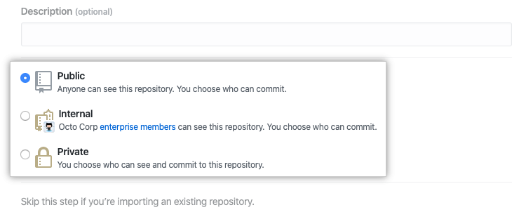

# Criando uma conta e seu primeiro repositório no GitHub

## Criando uma conta no GitHub

O GitHub permite você criar uma conta gratuita, para isso, basta acessar  [https://github.com/](https://github.com/) e seguir as instruções na tela para criar uma conta de usuário.

Dica: escolha um nome de usuário sem caracteres especiais como ç e acentos.

## Criando um repositório no GitHub

Repositório é um diretório onde os arquivos do seu projeto ficam armazenados. Ele pode ficar em um depósito do GitHub ou em seu computador. Você pode armazenar códigos, imagens, áudios, ou qualquer outra coisa relacionada ao projeto no diretório.

### Iniciando

1. No canto superior direito da página, clique no menu <strong>+</strong> e selecione a opção <strong>"New repository"</strong> (Novo repositório)

2. Informe um nome sem espaços e caracteres especiais, de preferência um nome curto e fácil de memorizar. Por exemplo: "hello-world" (ola-mundo).

3. Se desejar, adicione uma descrição do repositório. Por exemplo, "My first repository on GitHub" (Meu primeiro repositório no GitHub).

4. Informe a visibilidade do seu repositório:
- <strong>Public:</strong> Qualquer pessoa na internet pode ver este repositório.
- <strong>Internal:</strong> Repositório da organização e que será visivel somente a seus colaboradores. Obs: Essa opção só vai aparecer para você, se sua conta do GitHub for empresarial.
- <strong>Private:</strong> Você decide quem pode visualizar e contribuir com este repositório.

5. Inicie o seu repositório com um <strong>README</strong> (LEIAME), este arquivo irá servir para descrever melhor o seu projeto e fornecer instruções de como utilizar.

6. Conclua a criação do repositório, clicando no botão <strong>"Create repository"</strong> (Criar repositório).

### 

